# Agentic Workflow Engine

[](https://codecov.io/gh/alsalmanp/agentic-workflow-engine)

A Spring Boot application that uses AI agents to break down complex goals into tasks, execute them, and provide comprehensive summaries. Built with Java 24, Spring AI, and OpenAI integration.

## Architecture

The system uses a **pure orchestration pattern** with clean service separation and AI agent integration:

```mermaid
graph TB
    %% Top Layer - Orchestration
    subgraph "🎯 Orchestration Layer"
        WO[WorkflowOrchestrator]
    end
    
    %% Middle Layer - Services 
    subgraph "⚙️ Service Layer (Business Logic)"
        GS[GoalService]
        TPS[TaskPlanService]
        TPeS[TaskPersistenceService]
        TPrS[TaskPreparationService]
        TES[TaskExecutionService]
        PRS[PlanReviewService]
        WSS[WorkflowSummaryService]
    end
    
    %% Bottom Layer - Split into two sections
    subgraph "🧠 AI Agent Layer"
        TPA[TaskPlanAgent]
        TA[TaskAgent]
        GA[GoalAgent]
        LLM["🤖 OpenAI GPT-4o"]
    end
    
    subgraph "🏗️ Infrastructure Layer"
        TDR[TaskDependencyResolver]
        DR[DependencyResolver]
        WPS[WorkflowPersistenceService]
        DB[("🗄️ PostgreSQL")]
    end
    
    %% Orchestration to Services (Top to Middle)
    WO --> GS
    WO --> TPS
    WO --> TPeS
    WO --> TPrS
    WO --> TES
    WO --> PRS
    WO --> WSS
    
    %% Services to AI Agents (Middle to Bottom Left)
    TPS --> TPA
    TES --> TA
    WSS --> GA
    PRS --> TPA
    
    %% Services to Infrastructure (Middle to Bottom Right)
    GS --> WPS
    TPeS --> TDR
    TES --> DR
    TPrS --> DR
    PRS --> WPS
    WSS --> GS
    
    %% AI Agents to LLM
    TPA --> LLM
    TA --> LLM
    GA --> LLM
    
    %% Infrastructure Dependencies
    TDR --> WPS
    WPS --> DB
    
    %% Styling
    classDef orchestration fill:#e1f5fe,stroke:#01579b,stroke-width:3px
    classDef service fill:#f3e5f5,stroke:#4a148c,stroke-width:2px
    classDef agent fill:#fff3e0,stroke:#e65100,stroke-width:2px
    classDef infrastructure fill:#e8f5e8,stroke:#1b5e20,stroke-width:2px
    classDef external fill:#fce4ec,stroke:#880e4f,stroke-width:2px
    
    class WO orchestration
    class GS,TPS,TPeS,TPrS,TES,PRS,WSS service
    class TPA,TA,GA agent
    class TDR,DR,WPS infrastructure
    class DB,LLM external
```



### Architecture Layers

#### 🎯 **Orchestration Layer**
- **WorkflowOrchestrator**: Pure orchestrator with no business logic - only coordinates service calls

#### ⚙️ **Service Layer (Business Logic)**
- **GoalService**: Goal lifecycle management and persistence
- **TaskPlanService**: Task plan creation (encapsulates TaskPlanAgent)
- **TaskPersistenceService**: Task persistence coordination
- **TaskPreparationService**: Dependency validation and cleanup
- **TaskExecutionService**: Parallel execution and dependency resolution
- **PlanReviewService**: Plan reviews and task state updates
- **WorkflowSummaryService**: Summary generation (encapsulates GoalAgent)

#### 🧠 **AI Agent Layer**
- **TaskPlanAgent**: Creates intelligent task plans with dependency analysis
- **TaskAgent**: Executes individual tasks with context awareness
- **GoalAgent**: Generates comprehensive workflow summaries

#### 🏗️ **Infrastructure Layer**
- **TaskDependencyResolver**: Coordinates persistence and UUID mapping
- **DependencyResolver**: Analyzes task dependencies for parallel execution
- **WorkflowPersistenceService**: Shared database access layer
- **PostgreSQL**: Persistent storage for goals, tasks, and dependencies

## Features

### 🚀 **Async Workflow Engine**
- ✅ **Instant API responses** - Get goal ID immediately, workflow runs in background
- ✅ **Real-time progress tracking** - Monitor task execution as it happens
- ✅ **Virtual thread execution** - Efficient async processing with Java 24 virtual threads
- ✅ **REST API endpoints** - Start workflows and track progress via simple HTTP calls

### 🧠 **Intelligent Task Management**
- ✅ **Dependency-aware parallel execution** - Tasks run in parallel when dependencies allow
- ✅ **Smart task planning** with blocking and informational dependencies  
- ✅ **Dynamic task planning** that adapts based on task results
- ✅ **Context-aware task execution** with completed task results
- ✅ **Circular dependency detection** prevents infinite loops

### 🎯 **Template System** (Phase 1 & 2)
- ✅ **Pre-built workflow templates** - Start with expert-designed templates
- ✅ **Rich parameter types** - STRING, NUMBER, SELECTION, DATE, CURRENCY, LOCATION
- ✅ **Parameter validation** - Type-safe validation with helpful error messages
- ✅ **Default values** - Optional parameters with sensible defaults
- ✅ **Template discovery** - Browse and search available templates

### 🏗️ **Technical Excellence**
- ✅ **PostgreSQL persistence** - Tasks persist immediately for real-time tracking
- ✅ **Immutable domain records** following Java best practices
- ✅ **Comprehensive logging** for debugging parallel execution
- ✅ **OpenAI GPT-4o integration** for intelligent task planning and dependency analysis
- ✅ **Rate limiting resilience** with exponential backoff retry logic
- ✅ **Optimized token usage** to reduce API costs and avoid limits

## Prerequisites

- Java 24 (with preview features enabled)
- PostgreSQL database
- OpenAI API key
- Maven 3.6+

## Setup

### 1. Database Setup

Start PostgreSQL using Docker Compose:

```bash
docker compose up -d
```

This will create a PostgreSQL database with:
- Database: `agentic_workflow`
- Username: `postgres`
- Password: `password`
- Port: `5432`

### 2. Environment Variables

Set your OpenAI API key:

```bash
export OPENAI_API_KEY="your-openai-api-key-here"
```

### 3. Build and Run

**Option A: IntelliJ IDEA (Recommended)**
1. Import the project into IntelliJ IDEA
2. Configure OpenAI API key in IntelliJ's run configuration environment variables
3. Run `AgenticWorkflowEngineApplication` main class

**Option B: Maven**
```bash
# Build the application
./mvnw clean compile

# Run the application
./mvnw spring-boot:run
```

The application will start on `http://localhost:8080`

## API Usage

The workflow engine provides async APIs for both direct workflow execution and template-based workflows.

### Template System API

#### 1. List Available Templates

**Endpoint:** `GET /api/templates`

**Response:**
```json
[
  {
    "id": "550e8400-e29b-41d4-a716-446655440000",
    "name": "Simple Trip Planner",
    "description": "Plan a comprehensive trip with dates, budget, and style preferences",
    "category": "Travel",
    "author": "System",
    "isPublic": true,
    "createdAt": "2024-01-01T10:00:00Z"
  }
]
```

#### 2. Get Template Parameters

**Endpoint:** `GET /api/templates/{templateId}/parameters`

**Response:**
```json
[
  {
    "name": "destination",
    "description": "Where are you traveling to?",
    "type": "LOCATION",
    "required": true,
    "defaultValue": null
  },
  {
    "name": "startDate",
    "description": "Departure date",
    "type": "DATE",
    "required": true,
    "defaultValue": null
  },
  {
    "name": "duration",
    "description": "Number of days",
    "type": "NUMBER",
    "required": true,
    "defaultValue": null
  },
  {
    "name": "budget",
    "description": "Total budget with currency",
    "type": "CURRENCY",
    "required": false,
    "defaultValue": "1000 USD"
  },
  {
    "name": "travelStyle",
    "description": "Travel style preference",
    "type": "SELECTION",
    "required": false,
    "defaultValue": "Mid-range"
  }
]
```

#### 3. Execute Template

**Endpoint:** `POST /api/templates/{templateId}/execute`

**Request Body:**
```json
{
  "destination": "Tokyo, Japan",
  "startDate": "2024-12-15",
  "duration": "10",
  "budget": "3000 EUR",
  "travelStyle": "Luxury"
}
```

**Parameter Types:**
- **STRING**: Any text value
- **NUMBER**: Numeric values (integers or decimals)
- **SELECTION**: Predefined choice from a list
- **DATE**: Date in formats: `yyyy-MM-dd`, `MM/dd/yyyy`, or `dd/MM/yyyy`
- **CURRENCY**: Amount and currency code (e.g., "1000 USD", "EUR 2500")
- **LOCATION**: Geographic location (city, country, address)

**Response:**
```json
{
  "goalId": "123e4567-e89b-12d3-a456-426614174000",
  "message": "Template executed successfully",
  "success": true
}
```

Use the returned `goalId` to track workflow progress using the standard workflow endpoints below.

### Direct Workflow API

#### 1. Start Workflow Execution

**Endpoint:** `POST /api/workflow/execute`

**Request Body:**
```json
{
  "query": "Your goal or task description here"
}
```

**Response (Instant):**
```json
{
  "goalId": "550e8400-e29b-41d4-a716-446655440000",
  "message": "Workflow execution started"
}
```

The workflow executes asynchronously in virtual threads. Use the returned `goalId` to track progress.

**Two ways to monitor progress:**
- **Goal Status**: High-level summary and completion status
- **Task Details**: Individual task progress and results

#### 2. Check Goal Status

**Endpoint:** `GET /api/workflow/goal/{goalId}`

**Response (High-level summary only):**
```json
{
  "id": "550e8400-e29b-41d4-a716-446655440000",
  "query": "Your original query",
  "summary": "AI-generated summary of the workflow execution",
  "status": "COMPLETED",
  "createdAt": "2024-01-01T10:00:00Z",
  "completedAt": "2024-01-01T10:10:00Z"
}
```

#### 3. Check Detailed Task Progress

**Endpoint:** `GET /api/workflow/goal/{goalId}/tasks`

**Use this endpoint to see all individual tasks and their detailed progress:**

**Response:**
```json
[
  {
    "id": "task-uuid-1",
    "description": "Research coffee shop market",
    "result": "Market research completed...",
    "status": "COMPLETED",
    "blockingDependencies": [],
    "informationalDependencies": [],
    "createdAt": "2024-01-01T10:00:00Z",
    "completedAt": "2024-01-01T10:02:00Z"
  },
  {
    "id": "task-uuid-2", 
    "description": "Develop business plan",
    "result": null,
    "status": "PENDING",
    "blockingDependencies": ["task-uuid-1"],
    "informationalDependencies": [],
    "createdAt": "2024-01-01T10:00:00Z",
    "completedAt": null
  }
]
```

### Task Status Values
- `PENDING` - Task created but not yet started
- `IN_PROGRESS` - Task currently executing (internal use)
- `COMPLETED` - Task finished successfully

## Complete Workflow Examples

The workflow engine demonstrates two key capabilities: **parallel execution** for independent tasks and **dependency-aware sequential execution** for dependent tasks.

## Example 1: Parallel Execution (Paris Travel Planning)

Independent tasks that can run simultaneously:

```bash
curl -X POST http://localhost:8080/api/workflow/execute \
  -H "Content-Type: application/json" \
  -d '{
    "query": "I am planning a 3-day trip to Paris. Can you create a travel plan for me? The plan should include a suggested daily itinerary, a list of 5 highly-rated French restaurants, and a summary of the public transportation options available"
  }'
```

**Result: All 3 tasks execute in parallel** ⚡

```json
[
  {
    "description": "Research and create a suggested daily itinerary for the 3-day trip to Paris.",
    "status": "COMPLETED",
    "blockingDependencies": [],
    "completedAt": "2025-07-27T07:21:32.191606Z"
  },
  {
    "description": "Compile a list of 5 highly-rated French restaurants in Paris.",
    "status": "COMPLETED", 
    "blockingDependencies": [],
    "completedAt": "2025-07-27T07:21:36.290143Z"
  },
  {
    "description": "Summarize the public transportation options available in Paris.",
    "status": "COMPLETED",
    "blockingDependencies": [],
    "completedAt": "2025-07-27T07:21:31.585999Z"
  }
]
```

## Example 2: Dependency-Aware Sequential Execution (Coffee Shop Business)

Dependent tasks that must execute in logical order:

```bash
curl -X POST http://localhost:8080/api/workflow/execute \
  -H "Content-Type: application/json" \
  -d '{
    "query": "Help me start a coffee shop business including market research, business plan, permits, and initial setup"
  }'
```

**Result: Smart sequential execution based on dependencies** 🧠

```json
[
  {
    "description": "Conduct market research to understand target audience, competition, and location feasibility.",
    "status": "COMPLETED",
    "blockingDependencies": [],
    "completedAt": "2025-07-27T07:23:21.142896Z"
  },
  {
    "description": "Create a comprehensive business plan including financial projections, marketing strategy, and operational plan.",
    "status": "PENDING",
    "blockingDependencies": ["d8459ff3-214c-4e81-9057-970444086e2a"]
  },
  {
    "description": "Obtain necessary permits and licenses to legally operate the coffee shop.",
    "status": "COMPLETED",
    "informationalDependencies": ["102ac44a-05ce-4862-8580-51b54eff582f"],
    "completedAt": "2025-07-27T07:23:16.129208Z"
  },
  {
    "description": "Identify and secure a location for the coffee shop.",
    "status": "COMPLETED", 
    "informationalDependencies": ["d8459ff3-214c-4e81-9057-970444086e2a"],
    "completedAt": "2025-07-27T07:23:15.619491Z"
  },
  {
    "description": "Set up the coffee shop's physical space, including interior design, equipment purchase, and installation.",
    "status": "PENDING",
    "blockingDependencies": ["cb1b29fe-2fc3-4c4a-98e1-58ae3b8ed9f5"]
  }
]
```

### Key Features Demonstrated

✅ **Intelligent Planning**: AI automatically detects which tasks can run in parallel vs. sequentially  
✅ **Maximum Efficiency**: Independent tasks execute simultaneously  
✅ **Logical Dependencies**: Tasks wait for required inputs from other tasks  
✅ **Context Awareness**: Dependent tasks use outputs from completed dependencies  
✅ **Real-time Tracking**: Monitor progress as tasks complete

### Why GPT-4o for Task Dependencies

The system uses **OpenAI GPT-4o** specifically for its superior capability in understanding complex task relationships:

✅ **Enhanced Reasoning**: GPT-4o significantly outperforms GPT-4 in analyzing logical task dependencies  
✅ **Parallel vs Sequential**: Better distinguishes between tasks that can run in parallel vs those requiring sequential execution  
✅ **Dependency Types**: More accurately identifies blocking dependencies vs informational dependencies  
✅ **Context Understanding**: Superior at understanding when one task's output is truly needed as input for another  
✅ **Optimization**: Creates more efficient execution plans by minimizing unnecessary sequential bottlenecks

This improvement was critical for the coffee shop example, where GPT-4 would often create unnecessary blocking dependencies, while GPT-4o correctly identifies that permits and location research can happen in parallel with market research.


## Configuration

### Application Configuration

Key configuration options in `application.yaml`:

```yaml
spring:
  # OpenAI Configuration
  ai:
    openai:
      api-key: ${OPENAI_API_KEY}
      chat:
        options:
          model: gpt-4o
          temperature: 0.7
          max-tokens: 1000

  # Database Configuration
  datasource:
    url: ${DATABASE_URL:jdbc:postgresql://localhost:5432/agentic_workflow}
    username: ${DATABASE_USERNAME:postgres}
    password: ${DATABASE_PASSWORD:password}
    driver-class-name: org.postgresql.Driver

# Logging
logging:
  level:
    dev.alsalman.agenticworkflowengine: DEBUG
    org.springframework.web: INFO
    org.springframework.ai: INFO
```

### Environment Variables

- `OPENAI_API_KEY` - Your OpenAI API key (required)
- `DATABASE_URL` - PostgreSQL connection URL (optional, defaults to localhost)
- `DATABASE_USERNAME` - Database username (optional, defaults to postgres)
- `DATABASE_PASSWORD` - Database password (optional, defaults to password)

## Development

### Running Tests

```bash
./mvnw test
```

### Building for Production

```bash
./mvnw clean package
java --enable-preview -jar target/agentic-workflow-engine-0.0.1-SNAPSHOT.jar
```

### Database Schema

The application automatically creates the required database schema on startup:

- `goals` table - Stores workflow goals and summaries  
- `tasks` table - Stores individual tasks with dependency information
- `task_dependencies` table - Stores detailed dependency relationships

## How Parallel Execution Works

The system intelligently executes tasks in parallel based on their dependencies:

### Dependency Types
- **Blocking Dependencies**: Task cannot start until these dependencies complete
- **Informational Dependencies**: Task can start but benefits from these dependency results

### Workflow Execution Flow


### Key Benefits

✅ **Pure Orchestration**: Orchestrator focuses only on coordination, no business logic  
✅ **Service Encapsulation**: Each service has single responsibility and clear boundaries  
✅ **AI Agent Isolation**: Agents wrapped by services, not directly accessed by orchestrator  
✅ **Independent Testing**: Each service can be tested in isolation with comprehensive coverage  
✅ **Enterprise Architecture**: Clean layering suitable for large-scale applications  
✅ **Parallel Efficiency**: Intelligent dependency resolution maximizes concurrent execution

## Logging

The application provides comprehensive logging at DEBUG level:

- Task planning and creation
- Individual task execution progress
- Plan reviews and updates
- Final summaries and execution times
- Error handling and debugging information

## Java 24 Features

This application leverages Java 24 preview features:

- **StructuredTaskScope** - For structured concurrency and virtual threads
- **Virtual Threads** - For efficient async operations
- **Preview Features** - Enabled via `--enable-preview` flag

## Architecture Principles

- **Pure Orchestration Pattern** - Orchestrator contains zero business logic, only coordinates services
- **Service-Based Architecture** - Each service encapsulates specific business concerns
- **AI Agent Encapsulation** - Agents wrapped by services for clean separation
- **Advanced AI Integration** - GPT-4o for superior task dependency analysis and parallel execution planning
- **Immutable Records** - All domain models use immutable Java records for thread safety
- **Virtual Threads** - Async operations use virtual threads over reactive programming
- **Spring Data JDBC** - Simple, direct database access through shared persistence layer
- **PostgreSQL** - Reliable, scalable database storage
- **Structured Concurrency** - Better async code organization and error handling
- **Enterprise Layering** - Clear separation between orchestration, business logic, and infrastructure

## Troubleshooting

### Common Issues

1. **Preview API warnings** - These are expected when using Java 24 preview features
2. **Database connection errors** - Ensure PostgreSQL is running and accessible
3. **OpenAI API errors** - Verify your API key is set and has sufficient credits
4. **Compilation errors** - Ensure Java 24 is installed and `--enable-preview` is configured

### Logs

Check application logs for detailed execution information:

```bash
# View recent logs
tail -f logs/application.log

# Or check console output when running with Maven
./mvnw spring-boot:run
```